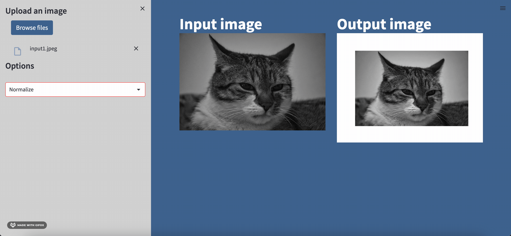
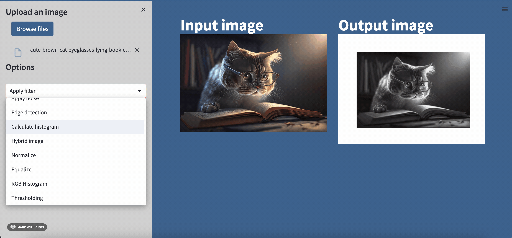

# Filtering and edge detection

A web application that use python script for image processing such as adding noise, denoising and detect the edges.

> ## Table of Contents

- [Built with](#Built-with)
- [Deployment](#Deployment)
- [Design](#Design)
- [Features](#Features)
- [Authors](#Authors)


> ## Built with


> ## Deployment

 Install streamlit

```bash
  pip install streamlit
```

To start deployment 
```bash
  streamlit run main.py
```

> ## 🖌️ Design


<!-- * **side bar** -->

<!--  -->

> ## Features
###  Apply Filter 

#### A. Frequency filters

1. Apply Highpass filter


2. Apply Lowpass filter


#### B. Denoising filters
1. Apply Gaussian filter


2. Apply Median filter


3. Apply Average filter 


###  Apply Noise
1. Gaussian noise


2. Uniform noise


3. Salt and pepper noise


###  Edge detection
1. Canny detector


2. Sobel detector
  - horizontal OR vertival
  

  - BOTH horizontal and vertical
  

3. Prewitt detector
  - horizontal OR vertival
  

  - BOTH horizontal and vertical
  

4. Roberts detector
 - horizontal OR vertival
  

  - BOTH horizontal and vertical
  

###  Equalize the image 


###  Normalize the image 


###  Histogram
1. Normal Histogram 


2. Equalize Histogram


###  RGB Histogram

1. Normal RGB Histogram 


2. Equalize RGB Histogram


###  Thresholding
#### A. Manual Thresholding
1. Local 


2. Global


#### A. Ostu's Thresholding
1. Local 

2. Global


###  Hybrid image


> ## 🔗 Authors
- Esraa Ali         
sec : 1   BN : 12

- Rawan Abdulhamid  
sec : 1   BN : 33

- Mostafa Mahmoud   
sec : 2   BN : 37

- Omar Mustafa      
sec : 2   BN : 5  

- Yehia Said        
sec : 2   BN : 53 


All rights reserved © 2023 to Team 9 - Systems & Biomedical Engineering, Cairo University (Class 2024)